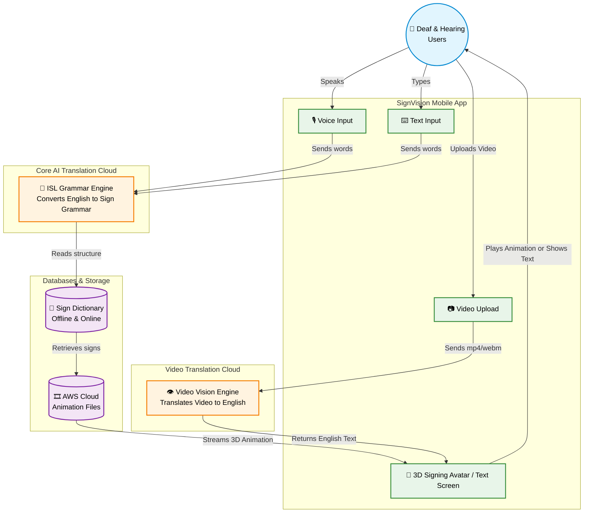
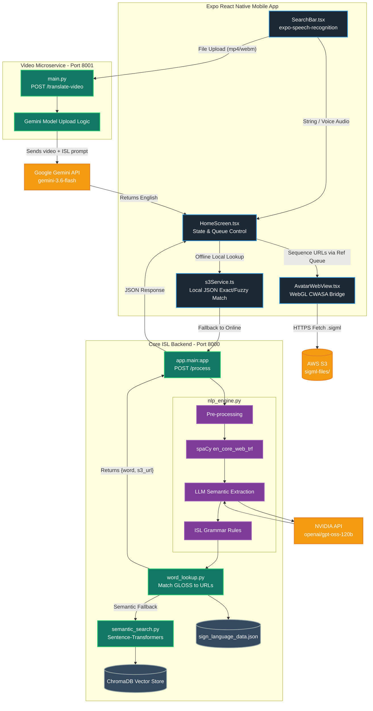

# SignVision System Architecture Design

This document outlines the architecture for the SignVision project. It is split into two sections: a **High-Level Design** intended for non-technical stakeholders (focusing on user flow and abstract components) and a **Low-Level Design** intended for engineers (focusing on microservices, specific technologies, pipelines, and data flow). 

Both sections feature a **Plain Text (ASCII) diagram** for quick reading natively in any text editor, followed by an advanced **Mermaid diagram** for enhanced visual rendering.

---

## 1. High-Level Architecture (For Non-Technical Audiences)

### Plain Text Diagram
```text
                          [ User (Target Audience: Deaf / Hearing) ]
                                                |
               [ Voice/Speech Input ]    [ Text Input ]    [ Video File Upload ]
                         \                      |                      /
                          \                     |                     /
                           v                    v                    v
 +-----------------------------------------------------------------------------------------+
 |                                 SignVision Mobile App                                   |
 |                                                                                         |
 |                [ Smart Input UI ]                    [ 3D Avatar Display UI ]           |
 +------------------|----------------|---------------------------------^-------------------+
                    |                |                                 |
   (Sends Voice/Text String)    (Sends Sign Video)                     |
                    |                |                                 |
                    v                v                                 |
 +-------------------------+     +--------------------------+          |
 |   Core AI Cloud Brain   |     | Video Translation Cloud  |          |
 |                         |     |                          |          |
 |  [ ISL Grammar Engine ] |     | [ Video Vision Engine ]  |          |
 |  (Understands rules &   |     |  (Analyzes sign language |          |
 |   translates English    |     |   video and translates   |          |
 |   into Sign structure)  |     |   it into English Text)  |          |
 +----------|--------------+     +------------|-------------+          |
            |                                 |                        |
            v                                 | (Returns English Text) |
 +-------------------------+                  |                        |
 |   Databases & Storage   |                  |                        |
 |                         |                  |                        |
 | [Text-to-Sign Mapping]  |                  |                        |
 | (Matches words to signs)|                  |                        |
 |                         |                  |                        |
 | [3D Animation Cloud]    |                  |                        |
 | (Provides AWS 3D files) |                  |                        |
 +----------|--------------+                  |                        |
            |                                 |                        |
            +---------------------------------+------------------------+
                                              |
                                              |
                                              |
                     (Displays 3D Avatar Animation OR Printed English Text)
```

### Mermaid Diagram


---

## 2. Low-Level Architecture (For Technical Engineers)

### Plain Text Diagram
```text
 +-------------------------------------------------------------------------+
 |                      Expo React Native Frontend                         |
 |                                                                         |
 |   [ SearchBar.tsx ] (Text/Voice)            [ Video UI ] (Video)        |
 |          |                                        |                     |
 |  (If offline word match)                          | (HTTP POST          |
 |  [ s3Service.ts ]          (HTTP POST /process)   |  /translate-video)  |
 +----------|------------------------|---------------|---------------------+
            |                        |               |
       (Local JSON)                  v               v
            |       +------------------------+  +------------------------+
            |       |Core Backend (Port 8000)|  |Video Service (Port 8001|
            |       |                        |  |                        |
            |       | [ spaCy POS Tagging ]  |  | [ File chunk uploader ]|
            |       |          |             |  |            |           |
            |       | [ NVIDIA LLM APIs ]    |  |            v           |
            |       |          |             |  |[Google Gemini Vision & |
            |       | [ ISL Transformer ]    |  | LLM Interpretation API]|
            |       |          |             |  |            |           |
            |       | [ ChromaDB Database ]  |  |            |           |
            |       +----------|-------------+  +------------|-----------+
            |                  |                             |
            |           (Returns Object)             (Returns English)
            v                  v                             |
 +--------------------------------------------------+        |
 |   [ AvatarWebView.tsx ] (Plays Sign Queue)       |<-------+
 |                       |                          |
 |   [ WebGL CWASA Avatar HTML ] <-- fetch .sigml   |
 +-----------------------|--------------------------+
                         v
              [ AWS S3 Cloud Bucket ]
```

### Mermaid Diagram


---

## 3. High-Level Summary of System Layers

### Presentation Layer
*   **Expo / React Native**: Acts as a thick client. Handles exact dictionary lookups instantly on device without a network requirement by scanning a bundled `sign_language_data.json` file.
*   **CWASA Render Bridge**: Embedded webview running UEA's CWASA javascript library to render WebGL 3D bone animations from SiGML descriptors. 

### Inference & Integration Layer
*   **Video to Text (8001)**: Relies on `google-genai` multi-modal vision capabilities to bypass custom ML vision training. Isolated microservice due to drastically different throughput/LLM requirements.
*   **Text to ISL (8000)**: Multi-stage pipeline. Uses `spaCy` for POS extraction, `NVIDIA LLM` strictly for contextual decomposition, and deterministic Python logic for ISL grammatical reordering to prevent hallucination.

### Storage & Embeddings Layer
*   **ChromaDB**: Holds 384-dimensional dense vectors created by `all-MiniLM-L6-v2` for semantic search (e.g. mapping "furious" to "ANGRY").
*   **AWS S3**: Securely hosts static `.sigml` animation payloads globally.
